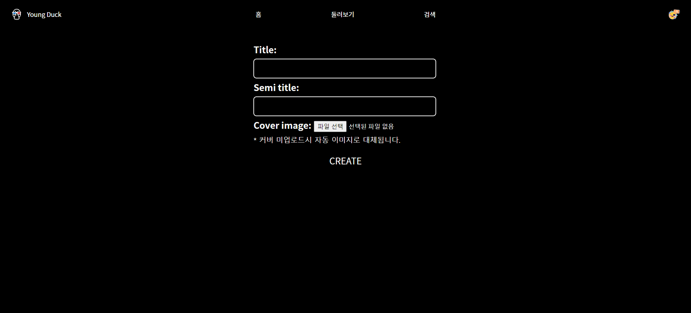
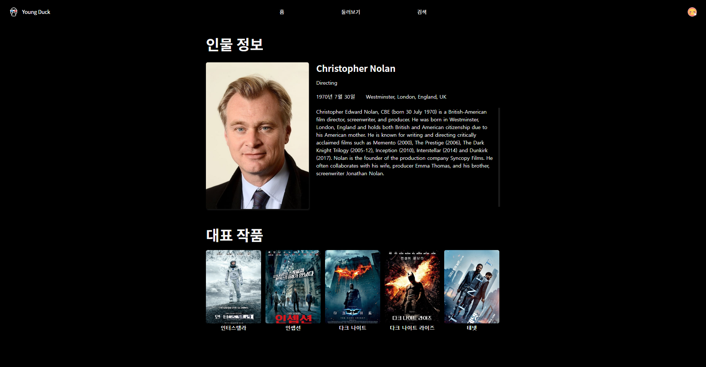

# Final Project

# 목차

1. 프로젝트 목표 소개
2. 팀원 정보 및 업무 분담 내역
3. 사용한 개발 도구 및 라이브러리
4. 각 app 및 기능(model)에 대한 설명
5. 데이터베이스 모델링(ERD), Fixture, URL, View
6. 서비스 대표 기능 설명
7. 목표 서비스 상세 설명 및 실제 구현 정도
8. 영화 추천 알고리즘 설명
9. 프로젝트 후기

## 1. 프로젝트 목표 소개

##### 공통 주제: 알고리즘을 기반으로 한 영화 추천 서비스

(SSAFY 8기 1학기 최종 프로젝트)

##### 팀 고유 주제: '기록과 수집'을 기반으로 한 영화 테마북 구현

(내가 봤거나 보고 싶은 영화를 기록하고, 카드 형태로 수집할 수 있도록!)

## 2. 팀원 정보 및 업무 분담 내역

#### ※ Frontend: 유한별

* html, css, js을 비롯한 전반적인 FE 관련 업무 수행
* 사이트 및 로고 디자인 담당
* 사이트 기능 구상, 기능 목록 정리 및 작성
* 프로젝트 소개 PPT 제작

#### ※ Backend: 임주연

* BD 및 프로젝트 app, model 등 구조 설계
* Django를 통한 기능 구현, API 파싱 등 전반적인 BE 관련 업무 수행
* 명세서, README를 비롯하여 대부분의 기록을 담당
* 유저 디폴트 아이콘, 테마북 디폴트 이미지 수집

## 3. 사용한 개발 도구 및 라이브러리

* Main(필수 개발 환경 관련)
  * Python 3.9+
  * Django 3.2.x
  * Vanilla JS
* 사용 도구
  * Visual Studio Code
  * Chrome Brower
  * Figma
  * diagrams.net
* 사용한 API
  * TMDB API
    * [TMDB API offical site](https://developers.themoviedb.org/3/getting-started/introductionhttps:/)
* django & python 관련 라이브러리
  * Pillow (django 이미지 관리 툴)
  * qrcode (qrcode 생성 툴)
  * requests (API 요청)
  * colorthief (movie backdrop 이미지 색깔 팔레트 추출)
    * [official github](https://https://github.com/fengsp/color-thief-py)
    * [how to use?](https://stackoverflow.com/questions/13811483/getting-dominant-color-of-an-image)
* 사용한 이미지 출처
  * icon default image : flaticon
    * [flaticon-free-stickers](https://www.flaticon.com/free-stickers/emoji?k=1668995263574&log-in=googlehttps:/)
  * book cover default image: pixabay
    * [pixabay](https://pixabay.com/ko/https:/)

## 4. 각 app 및 기능, model에 대한 설명

#### 본 프로젝트에는 총 3가지의 앱(app)이 존재합니다.

* movies: TMDB API를 통해 받은 영화 데이터를 조회 가능하도록 하는 기능 수행
* books: 테마북 CRUD, 영화 포토카드 CRUD 기능 수행
* accounts: 유저 계정에 관련된 대부분의 기능 수행

#### 해당 앱들은 이하의 model을 가지고 있습니다.

##### - movies

* Movie: 영화에 대한 정보들을 가지고 있습니다. People, Genre와는 N:M 관계에 있습니다.
* People: 영화 제작에 참여한 인물들(배우, 감독)에 대한 정보를 가지고 있습니다.
* Genre: 영화 장르에 대한 정보들을 가지고 있습니다.

##### - books:

* Book: 테마북과 관련된 정보를 가지고 있습니다.
* Card: 영화 포토카드에 대한 정보를 가지고 있습니다. Book과는 N:M, User, Movie와는 1:N 관계에 있습니다.

##### - accounts:

* User: 사이트에 가입한 이용자에 대한 정보를 가지고 있습니다.
* Profile: 유저 프로필에 대한 정보를 가지고 있습니다. User와는 1:1 관계에 있습니다.

## 5. 데이터베이스 모델링(ERD), Fixture, URL, View

### - 데이터베이스 모델링(ERD)

### - Fixture

* DB 내에서 사용되는 fixture 파일은 movies 앱 내에 위치합니다.
* fixture data의 load는 반드시 모델 정의(makemigrations) 및 migrate 이후에 직접 진행합니다.
* 이하의 순서대로 loaddata를 진행합니다(genre_list.json과 credit_list.json의 순서는 바뀌어도 무방함).
* genre_list.json(19 objects), credit_list.json(18653 objects), movie_list.json(2971 objects)은 모두 TMDB_API를 통해 파싱한 데이터입니다.

  1. `python manage.py loaddata genre_list.json`(model genre)
  2. `python manage.py loaddata credit_list.json`(model people)
  3. `python manage.py loaddata movie_list.json`(model movie)

##### * TMDB_API

###### 로직 설명

[참조한 블로그](https://velog.io/@ready2start/Mollbar-%ED%8A%B8%EB%9F%AC%EB%B8%94-%EC%8A%88%ED%8C%85-%EC%98%81%ED%99%94-%EB%8D%B0%EC%9D%B4%ED%84%B0-%EA%B0%80%EC%A0%B8%EC%98%A4%EA%B8%B0)

1. genre의 경우, Genre movie_list에서 리스트 째로 불러왔습니다.
2. movie의 경우, 먼저 Movie popular와 Movie top_rated에서 각각 150 페이지 씩 for문을 통해 데이터를 요청한 후, 그 중에서 해당하는 movie의 id 값만 가져와 별도의 json 파일(movie_id_list)에 저장했습니다(tmdb_api_movie_id_list.py).
3. people도 마찬가지로 popular에서 300 페이지 씩 for문을 돌려 데이터를 요청한 후, 해당하는 person의 id 값만을 별도의 json 파일(people_id_list)에 저장했습니다(tmdb_api_people_id_list.py).
4. 이후 영화 상세 정보를 불러옵니다. Movie detail에 이번에는 이전에 구한 popular & top_rated movie_id를 통해 요청을 보내 해당 영화들의 상세 정보들을 하나씩 가져옵니다(for문 이용).
5. 이때 genre는 N:M 관계이기에 id 값만 따로 가져와 리스트 형태로 저장해줍니다.
6. 이후 해당 영화의 pk 값을 통해 해당 영화에 출연하거나 제작에 참여한 인물들의 정보를 불러옵니다. (Movie credits)
7. 이때 기존에 구해둔 popular people_id_list와 대조한 후, 만약 해당될 시에만 해당 인물의 pk 값을 리스트에 담아 모든 대조작업이 끝난 후에 해당 movie data에 people이라는 field 명으로 추가해주고(N:M), 따로 credit.json으로 저장합니다. (tmdb_api_movies_detail.py, movie_list.json)
8. 마지막으로 credit.json을 이용하여 for문으로 해당 list에 들어있는 인물의 id 값을 통해 detail한 정보를 불러옵니다. (tmdb_api_credit_list.py, credit_list.json)

### - URL

##### (1) movies

| URL 패턴                    | 역할                                                                         |
| ----------------------------- | ------------------------------------------------------------------------------ |
| /movies/<movie_pk>/         | 단일 영화 상세 페이지 조회                                                   |
| /movies/person/<person_pk>/ | 인물 상세 페이지 조회                                                        |
| /movies/recommended/        | 추천 영화 페이지 조회                                                        |
| /movies/search/             | 키워드 기반 영화 관련 정보(movie, people, genre, book) 검색 결과 페이지 조회 |
| /movies/search/             | 영화 디테일 페이지에서 카드 생성 시, 테마북 검색 및 선택 페이지 조회         |

##### (2) books

| URL 패턴                                  | 역할                                                                                                                                               |
| ------------------------------------------- | ---------------------------------------------------------------------------------------------------------------------------------------------------- |
| /books/                                   | 사용자 본인 및 다른 사용자가 제작한 테마북 목록 페이지 조회 ⇒ 메인화면으로서, home과 같은 역할 수행(로그인한 사용자가 가장 먼저 보게 되는 페이지) |
| /books/create/                            | 새로운 테마북 생성 페이지 조회 & 단일 테마북 데이터 저장                                                                                           |
| /books/<book_pk>/detail/                  | 단일 테마북 상세 페이지 조회                                                                                                                       |
| /books/<book_pk>/update/                  | 테마북 데이터 수정 페이지 조회 & 단일 테마북 데이터 수정                                                                                           |
| /books/<book_pk>/delete/                  | 단일 테마북 데이터 삭제                                                                                                                            |
| /books/<book_pk>/like/                    | 단일 테마북 데이터 삭제                                                                                                                            |
| /books/cards/create/<book_pk>/<movie_pk>/ | 새로운 카드 생성 페이지 조회 & 단일 카드 데이터 저장                                                                                               |
| /books/cards/<card_pk>/                   | 단일 카드 상세 페이지 조회                                                                                                                         |
| /books/cards/<card_pk>/update/            | 카드 데이터 수정 페이지 조회 & 단일 카드 데이터 수정                                                                                               |
| /books/cards/<card_pk>/delete/            | 단일 카드 데이터 삭제                                                                                                                              |
| /books/<book_pk>/select/                  | 카드 생성 혹은 테마북에 기존 카드 추가 시, 카드를 만들기를 원하는 영화 검색 및 선택 페이지 조회                                                    |
| /books/<book_pk>/steal/                   | 다른 유저가 생성한 테마북과 그 하위 카드 데이터를 바탕으로 내 테마북 & 카드를 생성                                                                 |

##### (3) accounts

| URL 패턴                                       | 역할                                                                  |
| ------------------------------------------------ | ----------------------------------------------------------------------- |
| /accounts/signup/                              | 회원 생성 페이지 조회 & 단일 회원 데이터 생성 (회원 가입)             |
| /accounts/login/                               | 로그인 페이지 조회 & 세션 데이터 생성 및 저장 (로그인)                |
| /accounts/logout/                              | 세션 데이터 삭제 (로그아웃)조회                                       |
| /accounts/delete/                              | 단일 회원 데이터 삭제 (회원탈퇴)                                      |
| /accounts/password/                            | 비밀번호 수정 페이지 조회 & 단일 비밀번호 데이터 수정 (비밀번호 변경) |
| /accounts/search/                              | 사용자 검색 페이지 조회                                               |
| /accounts/[str:username](str:username)/        | 단일 사용자 상세 조회 페이지 (프로필 조회) ⇒ detail                  |
| /accounts/[str:username](str:username)/update/ | 단일 사용자 프로필 수정 페이지 조회                                   |
| /accounts/<user_pk>/follows/                   | 단일 사용자 팔로우 기능(비동기)                                       |

### - View

##### (1) movies

| **View 함수명** | **역할**                                                                        | **허용 HTTP Method** |
| :---------------- | :-------------------------------------------------------------------------------- | ---------------------- |
| detail          | 단일 영화 상세 페이지 조회                                                      | GET                  |
| detail_person   | 단일 인물 상세 페이지 조회                                                      | GET                  |
| recommended     | 알고리즘 기반 추천 영화 페이지 조회                                             | GET                  |
| search          | 영화 검색 페이지 조회                                                           | GET                  |
| select_book     | 영화 상세 페이지에서 카드 생성 시, 카드를 만들기 원하는 테마북 선택 페이지 조회 | GET                  |

##### (2) books

| **View 함수명** | **역할**                                                                         | **허용 HTTP Method** |
| :---------------- | :--------------------------------------------------------------------------------- | ---------------------- |
| index           | 테마북 목록 페이지 조회(home)                                                    | GET                  |
| create          | 새로운 테마북 생성 페이지 조회 & 단일 테마북 데이터 저장                         | GET & POST           |
| detail          | 단일 테마북 상세 페이지 조회                                                     | GET                  |
| update          | 단일 테마북 데이터 수정 페이지 조회 & 단일 테마북 데이터 수정                    | GET & POST           |
| delete          | 단일 테마북 데이터 삭제                                                          | POST                 |
| like            | 단일 테마북 좋아요 & 좋아요 취소 기능(비동기)                                    | POST                 |
| create_card     | 새로운 카드 생성 페이지 조회 & 단일 카드 데이터 저장                             | GET & POST           |
| detail_card     | 단일 카드 상세 페이지 조회                                                       | GET                  |
| update_card     | 단일 카드 데이터 수정 페이지 조회 & 단일 카드 데이터 수정                        | GET & POST           |
| delete_card     | 단일 카드 데이터 수정 페이지 조회 & 단일 카드 데이터 수정                        | POST                 |
| select_movie    | 테마북 상세 페이지에서 카드 제작 시, 원하는 영화 검색 및 선택                    | GET & POST           |
| steal_book      | 다른 유저가 생성한 테마북과 그 하위 카드 데이터를 바탕으로 내 테마북&카드를 생성 | POST                 |

##### (3) accounts

| **View 함수명** | **역할**                                                              | **허용 HTTP Method** |
| :---------------- | :---------------------------------------------------------------------- | ---------------------- |
| signup          | 회원 생성 페이지 조회 & 단일 회원 데이터 생성 (회원 가입)             | GET                  |
| login           | 로그인 페이지 조회 & 세션 데이터 생성 및 저장 (로그인)                | GET & POST           |
| logout          | 세션 데이터 삭제 (로그아웃)                                           | POST                 |
| update          | 회원 수정 페이지 조회 & 단일 회원 데이터 수정 (회원 정보 수정)        | GET & POST           |
| delete          | 단일 회원 데이터 삭제 (회원탈퇴)                                      | POST                 |
| change_password | 비밀번호 수정 페이지 조회 & 단일 비밀번호 데이터 수정 (비밀번호 변경) | GET & POST           |
| profile         | 사용자 상세 조회 페이지 (프로필 조회)                                 | GET                  |
| update_profile  | 사용자 프로필 수정 페이지 조회 및 단일 사용자 프로필 수정             | GET & POST           |
| follow          | 사용자 팔로우 기능                                                    | POST                 |
| search          | 사용자 검색 기능                                                      | GET & POST           |

## 6. 서비스 대표 기능 설명

* 영화 관련 테마북 제작 및 수집
* 영화 포토 티켓 제작 및 수집
* 영화, 인물, 장르, 테마북, 유저 검색 가능
* 영화, 인물 관련 정보 확인 가능(상세 페이지에서)
* 영화 추천 기능
* 다른 유저와는 간접적으로 소통(follow, 타인의 테마북 구경)

## 7. 목표 서비스 상세 설명 및 실제 구현 정도

#### 목표 서비스

##### accounts  

* 회원 가입, 로그인, 로그아웃, 회원 정보 수정, 비밀 번호 변경, 탈퇴(현재 프론트 상 구현 x), 팔로우, 프로필, 프로필 수정, 유저 찾기 기능을 이용할 수 있습니다.
* 로그인하지 않은 사용자는 로그인, 회원가입 페이지 이외의 페이지에 접근이 불가합니다. (is_authenticated)

* 회원 가입 시 profile은 자동으로 생성됩니다.
  * default nickname은 '{user.pk}번째 수집가' 입니다.
  * profile_img의 경우, 랜덤으로 지정됩니다.

* 유저 검색의 경우, username과 nickname 양쪽으로 동시에 검색이 가능합니다. (검색 결과는 구분되지 않고 뜨게 됨)
  * 유저 검색 사이트에서는 검색 결과로 나온 유저를 팔로우/언팔로우하는 것이 가능합니다.

* profile 상세 페이지에서는 해당 유저가 소유한 테마북 목록과 포토 카드 목록을 확인할 수 있습니다.
  * 만약 사용자 본인의 프로필 페이지라면 프로필 수정을, 다른 유저의 프로필 페이지라면, 해당 유저를 팔로우/언팔로우 하는 것이 가능합니다.

##### books

* books/index.html의 경우 메인 화면(home)과 같은 역할을 수행합니다.
* 현재 사용자(request.user)가 제작한 테마북(나의 테마북), 인기 테마북(like_users가 높은 순으로 선정), 최신 테마북(현재 사용자가 follow한 유저가 만든 테마북을 최신순(updated_at)으로 정렬)을 확인할 수 있습니다.
  * 이때 테마북의 cover_image, title, semi_title, 테마북 소유 유저의 profile_img를 시각적으로 확인하는 것이 가능합니다.

* 영화 관련 테마북을 생성, 수정, 열람, 삭제(현재 프론트상 구현 x)할 수 있습니다.
  * 테마북의 title, semi_title, cover_image를 지정해줄 수 있습니다.
  * 만약 cover_image를 지정하지 않을 경우, defalut image가 랜덤으로 주어집니다.

* 영화 포토 카드를 생성, 수정, 열람, 삭제하는 것이 가능합니다.
  * 영화 포토 카드에서는 my_score(사용자 자체 점수), my_comment, visited_count(관람 횟수) 값을 지정해줄 수 있습니다.
  * 만약 visited_count 값을 지정하지 않을 시, 자동으로 0이 지정됩니다.
  * 티켓에는 movie back_drop image, title, genre, credit 정보가 자동으로 지정되어 있으며, 티켓 상세 페이지에서 확인할 수 있습니다.
    * genre를 클릭하면 해당 장르의 검색 결과 페이지로, credit의 인물명 버튼을 클릭했을 시 해당 인물 상세 페이지로 이동합니다.
    * 만약 tmdb 측에서 video 정보가 제공되는 영화의 경우, 카드 내부에 qrcode가 생성됩니다.
      * 해당 qrcode를 카메라로 인식시킬 경우, 해당 영화의 유튜브 영상으로 이동합니다.
  * 영화 포토 카드의 색상은 해당 영화의 back_drop 이미지의 색상 팔레트 3번째 값이 부여됩니다. (colorthief)

* 테마북 상세 페이지에서는 해당 테마북에 맞는 포토 카드를 추가, 열람할 수 있습니다.
  * 테마북 상세 페이지 내의 카드는 포스터 이미지를 보여줍니다.
  * 이때 아직 관람하지 않은(visited_count == 0) 영화의 포토 카드의 경우 포스터가 흑백으로 출력됩니다.
  * 만약 영화 포토 카드를 새로 테마북에 추가하고 싶을 시, + 버튼을 누르면 추가가 가능합니다.
    * 추가하고 싶은 영화를 검색한 후, 검색 결과 리스트 중 원하는 영화를 선택하면 해당 영화에 대한 포토 카드가 생성됩니다.
    * 만약 이미 해당 테마북에 소속된 포토 카드의 영화라면, 자동으로 테마북에서 삭제됩니다.
    * 테마북에서 카드가 삭제된다고 해도 완전히 DB에서 삭제되는 것은 아닙니다. (현재 카드 삭제 및 계정 삭제와 마찬가지로 기능은 함수 구현은 되었으나, 프론트 측에서 추가되지 않았음)
  * 테마북 수정 및 삭제도 상세 페이지에서 가능합니다.
  * 좋아하는 테마북에는 하트 버튼을 누르는 것으로 해당 테마북을 좋아한다는 사실을 표현하는 것이 가능합니다.
  * 왼쪽 상단의 이미지를 누르면 해당 테마북을 소유한 유저의 프로필 페이지로 이동합니다.
* 다른 유저가 만들었거나, 내가 만든 테마북과 해당 테마북과 연결된 카드들의 정보를 가져와 완전히 같은 양식의 테마북을 만드는 것이 가능합니다. (steal_book)

##### movies  

  
* 영화 상세 페이지에서는 해당 영화에 대한 자세한 정보를 확인하는 것이 가능합니다.
  * 이때 title을 위시한 해당 영화 상세, 해당 영화에 출연한 popularity 상위 5명(더 적을 수도 있음), 해당 영화 카드가 담긴 테마북 정보를 확인할 수 있습니다.
  * 인물, 테마북은 클릭하면 상세 페이지로 이동이 가능합니다.
  * '추가하기' 버튼을 누르면 현재 사용자가 소유하고 있는 테마북이 버튼 형식으로 화면에 정렬되며, 그 중 하나를 선택하면 해당 테마북에 영화 포토 카드를 추가할 수 있습니다.

* 각 인물(배우, 감독)의 상세 페이지를 확인할 수 있습니니다.
  * 인물 상세 페이지에서는 해당 인물의 인적 사항 및 출연한 영화를 확인할 수 있습니다.
    * 영화 포스터 버튼을 누르면 해당 영화 상세 페이지로 이동합니다.

* 둘러보기(recommended)에서는 사이트 자체에서 추천하는 영화를 확인할 수 있습니다.
  * 추천 알고리즘에 대해서는 아래에서 설명합니다.

* 영화(movie), 인물(people), 장르(genre), 테마북(book)에 대한 전체 검색이 가능합니다.
  * 이때 검색 결과의 기준은 title(영화, 테마북), name(people, genre)에 해당 검색어를 포함하고 있는지의 여부입니다.
  * 검색 결과 정렬은 popularity 기준입니다(영화, 인물, 장르)

## 8. 영화 추천 알고리즘 설명

#### 사이트 이용자가 영화를 추천받는 방식으로는 크게 2 가지 방법이 존재합니다.

##### 1. 다른 유저의 테마북 확인

* 메인 화면에서 다른 유저(혹은 친구)가 제작한 테마북이 좋아요가 많은 순/최근 업데이트된 순으로 정렬되어 관람하는 것이 가능합니다.
* 사용자는 그 테마북들을 구경하면서, 다른 사람들은 어떤 영화를 보는지 확인이 가능하고, 해당 테마북과 카드들의 정보를 가져오는 것으로 새로운 영화 관람 목표를 세우는 것이 가능합니다.

##### 2. '둘러보기'(recommended) 게시판 이용

* '둘러보기' 게시판에서는 사이트 측이 추천하는 영화 목록을 확인할 수 있습니다.
  * 크게 2 가지 추천 방식이 존재합니다.
    * (1) 장르 목록 중 3 가지 장르를 임의로 설정하여, 해당 장르에 속한 영화들을 popularity가 높은 순으로 정렬하여 상위 5개만 사용자에게 추천합니다.
    * (2) 영화 상세 페이지에 접속할 때마다 'click_count'가 자동으로 1씩 증가합니다. 해당 수치가 높은 순으로 정렬한 후, 상위 5개만 사용자에게 추천합니다.

## 9. 프로젝트 후기

##### ※ 유한별
* 짧은 시간동안 몰입해서 무언가를 만드는 경험이 매우 새롭고 즐거웠다.
* 기획 단계의 중요성을 깨달았다. 기능 목록과 명세를 아주 세세하게 작성하지 않았으면 정말 많이 헤맸을 듯.
* Vue.js를 사용해보고 싶었으나 시간적 제약으로 인해 도전하지 못했다. 방학 때 꼭 framework를 활용한 프로젝트를 진행해봐야겠다.
* 페어프로그래밍은 2배로 힘들고 2배로 성장하는 기회인 것 같다.

##### ※ 임주연

* 지금까지는 홀로 코딩하는 것에 익숙했지만, 팀원과의 협업을 통해 최종 프로젝트를 진행하려니 많이 생경하기만 했다.
* 하지만 시간이 갈수록 내가 혼자서는 할 수 없는 것을 협업을 통해서라면 구현할 수 있다는 점, 내 작업에 대해 평가해줄 수 있는 사람이 있다는 것이 매우 즐거웠던 것 같다.
* 그리고 평소에 소망했던 백엔드 업무를 도맡아 django, SQL 문법 및 RESTful API 등에 대해 보다 깊이 이해하게 되었으며, 굉장히 값진 경험이었다고 생각한다.
* 시간 부족으로 미처 구현하지 못한 기능들에 아쉬움도 많지만 더 발전하면 된다는 자신감이 솟는다. 방학 때는 백엔드도 물론이지만 프론트엔드 관련, 특히 Vue에 대해 더 배우고 싶다.
